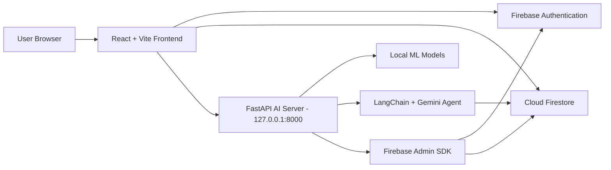
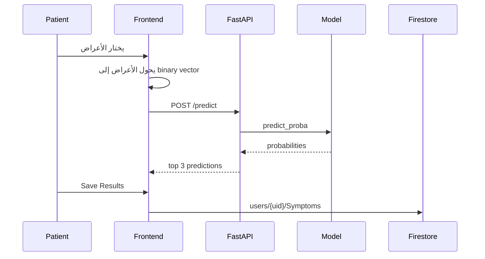
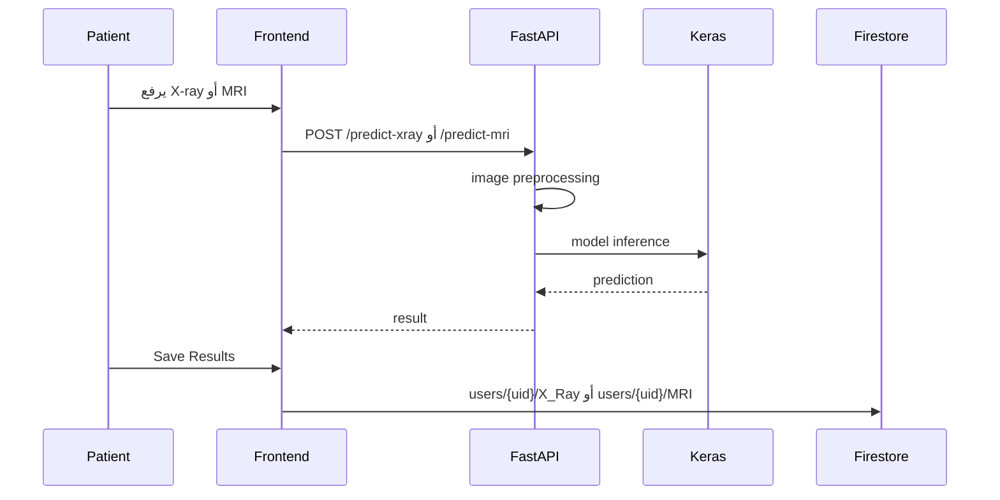
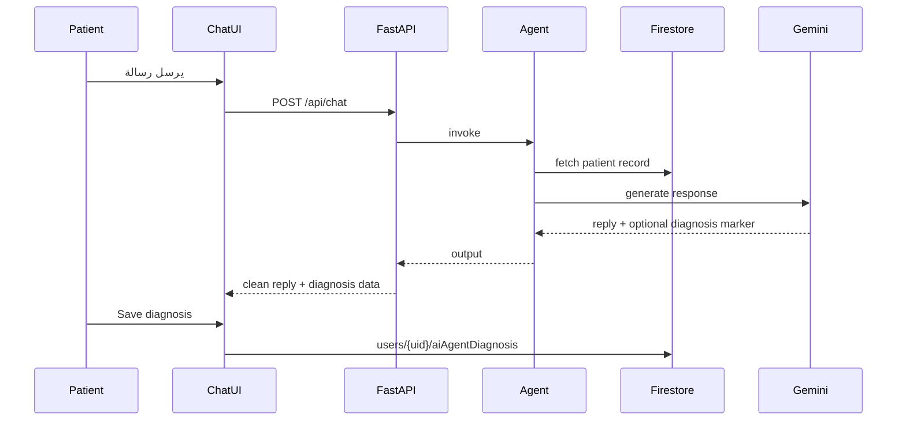
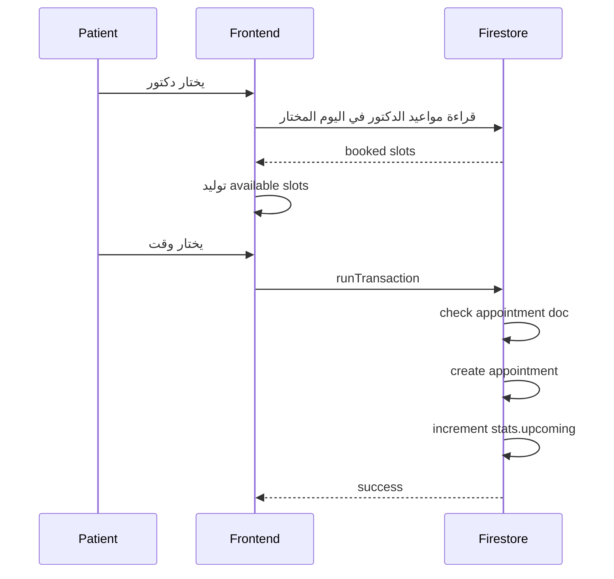

# شرح مشروع Medora والـ Architecture

## 1. فكرة المشروع

**Medora** هو نظام رعاية صحية مدعوم بالذكاء الاصطناعي. الهدف منه إن المريض يقدر يسجل، يكمل بياناته الصحية، يعمل تحليل أعراض أو يرفع صور أشعة، يحفظ نتائج الـ AI، يتكلم مع مساعد طبي ذكي، وبعدها يحجز مع دكتور مناسب. في نفس الوقت الدكتور يقدر يشوف مواعيده وملفات المرضى ونتائج التحليلات، والـ admin يقدر يدير حسابات الدكاترة.

المشروع متقسم لجزئين رئيسيين:

- **Frontend**: تطبيق React/Vite مسؤول عن الواجهة، تسجيل الدخول، الـ dashboards، والتعامل المباشر مع Firebase.
- **AI/API Server**: سيرفر Python/FastAPI مسؤول عن موديلات الذكاء الاصطناعي، الـ chatbot agent، وعمليات admin التي تحتاج Firebase Admin SDK.

---

## 2. نظرة عامة على الـ Architecture



الـ frontend بيتعامل مع Firebase مباشرة في أغلب وظائف التطبيق مثل تسجيل الدخول، قراءة المستخدمين، قراءة المواعيد، وحفظ نتائج التحاليل. أما أي وظيفة تحتاج AI inference أو صلاحيات server-side مثل إنشاء دكتور أو حذفه، فهي بتتم عن طريق FastAPI.

---

## 3. التقنيات المستخدمة

### Frontend

- **React 18** لبناء الواجهة.
- **TypeScript** لتنظيم الكود وتقليل الأخطاء.
- **Vite** للتشغيل المحلي والـ build.
- **React Router DOM** لإدارة الصفحات والـ protected routes.
- **Tailwind CSS** للتصميم.
- **shadcn-ui / Radix UI** لمكونات UI جاهزة.
- **lucide-react** للأيقونات.
- **Firebase JS SDK** للتعامل مع Authentication و Firestore.
- **TanStack React Query** متضاف كـ provider عام، لكن معظم الـ data fetching الحالي معمول مباشرة بـ Firebase SDK و `fetch`.

### Backend / AI Server

- **FastAPI** لبناء الـ API endpoints.
- **TensorFlow/Keras** لتشغيل موديلات X-ray و MRI.
- **joblib / scikit-learn** لتشغيل موديل توقع الأمراض من الأعراض.
- **OpenCV / NumPy / PIL** لمعالجة الصور قبل إدخالها للموديلات.
- **LangChain** لبناء الـ medical chatbot agent.
- **Google Gemini** من خلال `langchain_google_genai`.
- **Firebase Admin SDK** لإدارة حسابات الدكاترة والوصول لـ Firestore من السيرفر.

---

## 4. هيكل الملفات

```text
.
├── public/
├── src/
│   ├── ai_server/
│   │   ├── main.py
│   │   ├── agent.py
│   │   ├── tools.py
│   │   ├── gaussian_model.pkl
│   │   ├── label_encoder.pkl
│   │   ├── X_RAY_MOBILENET.keras
│   │   └── brain_tumor_Mobilenet.keras
│   ├── assets/
│   │   └── hero-medical.jpg
│   ├── components/
│   │   ├── AIChatbot.tsx
│   │   ├── AIProcessingAnimation.tsx
│   │   ├── Navbar.tsx
│   │   ├── loading.tsx
│   │   └── ui/
│   ├── config/
│   │   └── firebase.ts
│   ├── context/
│   │   ├── AuthContext.tsx
│   │   └── loadingcontext.tsx
│   ├── pages/
│   │   ├── Index.tsx
│   │   ├── Auth.tsx
│   │   ├── CompleteProfileModal.tsx
│   │   ├── PatientDashboard.tsx
│   │   ├── DoctorDashboard.tsx
│   │   ├── AdminPanel.tsx
│   │   ├── AddDoctorForm.tsx
│   │   └── NotFound.tsx
│   ├── App.tsx
│   ├── main.tsx
│   ├── index.css
│   └── Types.ts
├── package.json
├── vite.config.ts
├── tailwind.config.ts
└── README.md
```

---

## 5. نقطة بداية التطبيق

### `src/main.tsx`

ده ملف تشغيل React الأساسي. بيعمل render لـ `App` وبيغلفها بـ:

- `LoadingProvider`: مسؤول عن حالة التحميل العامة.
- `AuthProvider`: مسؤول عن وضع شاشة المصادقة، هل المستخدم في login ولا register.

### `src/App.tsx`

ده أهم ملف في الـ frontend architecture لأنه مسؤول عن:

- إنشاء `QueryClientProvider`.
- تشغيل `TooltipProvider` و toast components.
- مراقبة حالة Firebase Auth باستخدام `onAuthStateChanged`.
- قراءة بيانات المستخدم من `users/{uid}` باستخدام Firestore `onSnapshot`.
- دمج بيانات Firebase Auth مع بيانات Firestore.
- تحديد هل المستخدم admin أم patient أم doctor.
- حماية الـ routes وتوجيه كل role للصفحة المناسبة.

الـ admin حاليًا متعرف بشرط hardcoded:

```ts
user?.email === "admin@gmail.com" &&
user?.uid === "EWlEe7Z57kbXbDRNxrZvDdxnYOT2"
```

---

## 6. الـ Routing

| Route | Component | الوصف |
| --- | --- | --- |
| `/` | `Index` | الصفحة الرئيسية العامة |
| `/auth` | `Auth` | تسجيل الدخول أو إنشاء حساب |
| `/patient` | `CompleteProfileModal` أو `PatientDashboard` | صفحة المريض |
| `/doctor` | `DoctorDashboard` | صفحة الدكتور |
| `/admin` | `AdminPanel` | لوحة تحكم الأدمن |
| `*` | `NotFound` | أي route غير معروف |

بعض الصفحات تستخدم hash navigation لتغيير التبويبات:

- `/patient#overview`
- `/patient#ai-hub`
- `/patient#history`
- `/doctor#appointments`
- `/doctor#patients`
- `/admin#doctors`
- `/admin#analytics`

---

## 7. Firebase Integration

### ملف الإعداد

Firebase متعرف في:

```text
src/config/firebase.ts
```

الملف بيقرأ الإعدادات من environment variables الخاصة بـ Vite:

```text
VITE_FIREBASE_API_KEY
VITE_FIREBASE_AUTH_DOMAIN
VITE_FIREBASE_PROJECT_ID
VITE_FIREBASE_Storage_Bucket
VITE_FIREBASE_messagingSenderId
VITE_FIREBASE_appId
VITE_FIREBASE_measurementId
```

وبيصدر:

- `auth`: للتعامل مع Firebase Authentication.
- `db`: للتعامل مع Firestore.

### استخدام Firebase Auth

مستخدم في:

- تسجيل المرضى في `Auth.tsx`.
- تسجيل دخول المرضى والدكاترة والـ admin.
- تسجيل الخروج في `Navbar.tsx`.
- إرسال reset password للدكتور بعد إنشائه في `AddDoctorForm.tsx`.

### استخدام Firestore

Firestore هو قاعدة البيانات الأساسية للتطبيق، وبيخزن:

- المستخدمين.
- بيانات المرضى الصحية.
- التحاليل والنتائج.
- بيانات الدكاترة.
- المواعيد.
- تشخيصات الـ chatbot.

---

## 8. Firestore Data Model

### Collection: `users`

كل مستخدم له document بالـ UID الخاص به:

```text
users/{uid}
```

الحقول المشتركة:

```ts
{
  uid: string,
  fullname: string,
  email: string,
  role: "patient" | "doctor",
  createdAt: Timestamp
}
```

حقول المريض بعد إكمال البروفايل:

```ts
{
  age: number,
  height: number,
  weight: number,
  gender: string,
  lifestyle: {
    exercise: string,
    sleephours: number,
    smoking: string
  },
  stats: {
    cancelled: number,
    completed: number,
    upcoming: number
  }
}
```

حقول الدكتور:

```ts
{
  uid: string,
  fullname: string,
  email: string,
  role: "doctor",
  specialty: string,
  slotDuration: string,
  workingHours: {
    Sunday: { start: "09:00", end: "17:00" }
  },
  createdAt: Timestamp
}
```

### Subcollection: `users/{uid}/vitals`

بتتخزن فيها آخر وأرشيف القياسات الصحية:

```ts
{
  bloodPressure: {
    systolic: number | null,
    diastolic: number | null
  },
  bloodSugar: number | null,
  bmi: number,
  heartRate: number | null,
  status: {
    bmi: string,
    bp: string,
    hr: string,
    sugar: string
  },
  createdAt: Timestamp
}
```

### Subcollection: `users/{uid}/Symptoms`

نتائج موديل تحليل الأعراض:

```ts
{
  createdAt: Timestamp,
  predictions: {
    first: string,
    conf1: string,
    second: string,
    conf2: string,
    third: string,
    conf3: string
  }
}
```

### Subcollection: `users/{uid}/X_Ray`

نتائج تحليل أشعة X-ray:

```ts
{
  createdAt: Timestamp,
  predictions: "normal" | "pneumonia" | string
}
```

### Subcollection: `users/{uid}/MRI`

نتائج تحليل MRI:

```ts
{
  createdAt: Timestamp,
  predictions: "no_tumor" | "glioma" | "meningioma" | "pituitary" | string,
  confidence: number
}
```

### Subcollection: `users/{uid}/aiAgentDiagnosis`

تشخيصات الـ chatbot التي يختار المريض حفظها:

```ts
{
  summary: string,
  possible_conditions: string[],
  symptoms: string[],
  createdAt: Timestamp
}
```

### Collection: `appointments`

المواعيد محفوظة في collection مستقلة:

```text
appointments/{appointmentId}
```

شكل الـ ID:

```text
{doctorUid}_{yyyy-mm-dd}_{hh-mm}
```

شكل الـ document:

```ts
{
  patientId: string,
  patientName: string,
  doctorId: string,
  doctorName: string,
  specialty: string,
  date: string,
  timeSlot: string,
  status: "upcoming" | "cancelled" | "completed" | string,
  createdAt: Timestamp
}
```

الحجز بيتم بـ Firestore transaction عشان يمنع حجز نفس الدكتور في نفس اليوم والوقت مرتين.

---

## 9. شرح صفحات الـ Frontend

### `Index.tsx`

الصفحة العامة للمشروع. فيها:

- Hero section.
- مميزات المنصة.
- خطوات الاستخدام.
- التخصصات.
- Testimonials.
- CTA للتسجيل أو الدخول.

### `Auth.tsx`

صفحة التسجيل والدخول.

في حالة register:

1. يتم إنشاء user في Firebase Auth.
2. يتم إنشاء document في `users/{uid}`.
3. التسجيل الحالي مخصص للمريض فقط من الواجهة.

في حالة login:

1. يتم تسجيل الدخول بـ Firebase Auth.
2. يتم قراءة user document من Firestore.
3. يتم التأكد إن role المختار في الواجهة يطابق role المخزن.
4. `App.tsx` يتولى التوجيه للصفحة المناسبة.

### `CompleteProfileModal.tsx`

صفحة إكمال بروفايل المريض بعد التسجيل.

الخطوات:

1. العمر والنوع.
2. الطول والوزن وحساب BMI.
3. نمط الحياة: الرياضة، النوم، التدخين.
4. القياسات الحيوية: الضغط، النبض، السكر.

عند الحفظ:

- يتم تحديث `users/{uid}` ببيانات المريض.
- يتم إضافة document جديد في `users/{uid}/vitals`.

### `PatientDashboard.tsx`

الصفحة الأساسية للمريض.

التبويبات:

- `overview`: ملخص حالة المريض.
- `ai-hub`: اختيار أعراض ورفع صور X-ray/MRI.
- `results`: عرض نتائج الـ AI.
- `doctors`: عرض الدكاترة.
- `booking`: حجز موعد.
- `history`: تاريخ المواعيد.

أهم الوظائف:

- تحويل قائمة الأعراض المختارة إلى vector من 0 و 1.
- استدعاء `/predict` لتحليل الأعراض.
- استدعاء `/predict-xray` لتحليل X-ray.
- استدعاء `/predict-mri` لتحليل MRI.
- حفظ النتائج في Firestore.
- قراءة الدكاترة من `users` حيث `role == "doctor"`.
- قراءة مواعيد المريض من `appointments`.
- إنشاء time slots بناءً على `workingHours` و `slotDuration`.
- حجز الموعد داخل `runTransaction`.

### `DoctorDashboard.tsx`

لوحة الدكتور.

التبويبات:

- `overview`: ملخص وجدول اليوم.
- `appointments`: مواعيد الدكتور.
- `patients`: سجلات المرضى المرتبطين بمواعيده.

أهم الوظائف:

- يعمل realtime subscribe على `appointments` الخاصة بالدكتور.
- يحسب عدد المرضى وعدد مواعيد اليوم.
- يقرأ لكل مريض أحدث:
  - vitals.
  - Symptoms result.
  - MRI result.
  - X_Ray result.
  - aiAgentDiagnosis.
- يعرض modal فيه ملخص طبي ونتائج AI للمريض.

### `AdminPanel.tsx`

لوحة الأدمن.

التبويبات:

- `overview`: موجودة كـ coming soon.
- `doctors`: إدارة الدكاترة.
- `users`: موجودة كـ coming soon.
- `analytics`: موجودة كـ coming soon.

أهم الوظائف:

- قراءة الدكاترة realtime من `users` حيث `role == "doctor"`.
- فتح `AddDoctorForm` لإنشاء دكتور.
- حذف دكتور عن طريق endpoint في FastAPI.

### `AddDoctorForm.tsx`

Form يستخدمه الـ admin لإنشاء دكتور.

الخطوات:

1. إدخال الاسم والإيميل والتخصص ومدة الـ slot.
2. اختيار أيام وساعات العمل.
3. إرسال البيانات إلى:

```text
POST http://127.0.0.1:8000/api/admin/create-doctor
```

4. السيرفر ينشئ حساب Firebase Auth للدكتور.
5. السيرفر ينشئ document للدكتور في Firestore.
6. الواجهة ترسل reset password email للدكتور.

---

## 10. المكونات المشتركة

### `Navbar.tsx`

Navbar متغير حسب نوع المستخدم:

- الزائر يرى روابط عامة وزر الدخول.
- المريض يرى dashboard و AI diagnostics و appointments.
- الدكتور يرى dashboard و patients و appointments.
- الأدمن يرى overview و doctors و users.

كمان يحتوي على logout باستخدام Firebase Auth.

### `AIChatbot.tsx`

مكون chatbot عائم.

الـ flow:

1. المريض يكتب رسالة.
2. المكون يجهز `chat_history`.
3. يرسل الطلب إلى:

```text
POST http://127.0.0.1:8000/api/chat
```

4. السيرفر يرجع reply.
5. لو فيه diagnosis data، يظهر زر حفظ التشخيص.
6. التشخيص يتحفظ في:

```text
users/{uid}/aiAgentDiagnosis
```

### `AIProcessingAnimation.tsx`

مكون loading بصري أثناء تحليل الذكاء الاصطناعي.

### `components/ui/*`

مجموعة مكونات UI مبنية على shadcn/Radix مثل buttons, dialogs, inputs, tabs, select, table وغيرها.

---

## 11. Backend / AI Server

موجود في:

```text
src/ai_server
```

### `main.py`

ده ملف FastAPI الرئيسي.

مسؤول عن:

- تحميل `.env` من جذر المشروع.
- التأكد من وجود `GOOGLE_API_KEY`.
- تشغيل CORS.
- تحميل موديلات ML.
- تعريف endpoints الخاصة بالتحليل.
- تعريف endpoint الخاص بالـ chatbot.
- تعريف endpoints الخاصة بإضافة وحذف دكتور.

الـ frontend متوقع إن السيرفر شغال على:

```text
http://127.0.0.1:8000
```

### Endpoints

| Method | Endpoint | الوظيفة |
| --- | --- | --- |
| `POST` | `/predict` | توقع أعلى 3 أمراض من vector الأعراض |
| `POST` | `/predict-xray` | تحليل X-ray وإرجاع `normal` أو `pneumonia` |
| `POST` | `/predict-mri` | تحليل MRI وإرجاع نوع الورم أو `no_tumor` |
| `POST` | `/api/chat` | تشغيل Medora AI chatbot |
| `POST` | `/api/admin/create-doctor` | إنشاء حساب دكتور |
| `DELETE` | `/api/admin/delete-doctor/{doctor_uid}` | حذف حساب دكتور |

### `/predict`

الطلب:

```json
{
  "symptoms": [0, 1, 0, 1]
}
```

السيرفر يستخدم:

- `gaussian_model.pkl`
- `label_encoder.pkl`

ويرجع:

```json
{
  "status": "success",
  "predictions": [
    { "disease": "disease_name", "confidence": "83.20%" }
  ]
}
```

### `/predict-xray`

يستقبل صورة كـ multipart form.

المعالجة:

1. قراءة الصورة.
2. decode باستخدام OpenCV.
3. تحويل BGR إلى RGB.
4. resize إلى `224x224`.
5. تطبيق `preprocess_input`.
6. تشغيل موديل `X_RAY_MOBILENET.keras`.
7. إرجاع `pneumonia` إذا النتيجة أكبر من `0.5`، غير كده `normal`.

### `/predict-mri`

يستقبل صورة MRI، ويستخدم:

```text
brain_tumor_Mobilenet.keras
```

والـ classes هي:

```python
["no_tumor", "glioma", "meningioma", "pituitary"]
```

### `/api/chat`

الطلب:

```json
{
  "patient_id": "firebase-user-id",
  "user_message": "I have chest pain",
  "chat_history": [
    { "role": "user", "content": "..." },
    { "role": "assistant", "content": "..." }
  ]
}
```

السيرفر يرسل للـ agent الرسالة ومعها patient id. الـ agent يقدر يستخدم أدوات LangChain لقراءة بيانات المريض والدكاترة.

الرد:

```json
{
  "reply": "assistant visible text",
  "diagnosis_ready": true,
  "diagnosis_data": {
    "summary": "...",
    "possible_conditions": ["..."],
    "symptoms": ["..."]
  }
}
```

لو الـ agent أضاف marker باسم:

```text
[[DIAGNOSIS_READY]]
```

فـ `main.py` يفصل الـ JSON عن الرد العادي ويبعته للواجهة كـ structured data.

---

## 12. LangChain Agent

### `agent.py`

بيعرّف Medora AI assistant.

المكونات:

- `ChatGoogleGenerativeAI` باستخدام `gemini-2.5-flash`.
- Prompt طبي فيه rules للسلامة.
- Tools:
  - `get_patient_record`
  - `get_doctors_list`
- `AgentExecutor`.

قواعد الـ agent المهمة:

- يبدأ بجلب سجل المريض.
- يسأل أسئلة توضيحية واحدة واحدة.
- يدمج الأعراض الحالية مع بيانات Firestore.
- لا يقدم تشخيص نهائي قاطع.
- لا يصف جرعات أدوية.
- يوصي بدكتور فقط لو المريض طلب توصية صريحة.
- عندما يكوّن assessment كامل، يضيف JSON marker ليتم حفظه.

### `tools.py`

مسؤول عن Firebase Admin initialization باستخدام:

```text
src/ai_server/serviceAccountKey.json
```

الدوال:

- `fetch_patient_medical_record(patient_id)`
  - يقرأ `users/{patient_id}`.
  - يتأكد إن المستخدم patient.
  - يرجع بيانات شخصية، lifestyle، stats، وأحدث vitals.
- `get_all_available_doctors()`
  - يقرأ كل users حيث `role == "doctor"`.
  - يرجع الاسم والتخصص والمواعيد المتاحة.

ملحوظة: قراءة radiology و symptoms داخل `tools.py` موجودة كتعليقات حاليًا، بينما `DoctorDashboard.tsx` يقرأها مباشرة من الواجهة.

---

## 13. تدفق تحليل الأعراض



---

## 14. تدفق تحليل الأشعة



---

## 15. تدفق الـ Chatbot



---

## 16. تدفق حجز الموعد



---

## 17. صلاحيات وتجربة كل Role

### Patient

- يسجل حساب.
- يكمل بروفايله الصحي.
- يشغل AI diagnostics.
- يحفظ نتائج الأعراض والأشعة.
- يحجز موعد مع دكتور.
- يستخدم Medora AI chatbot.

### Doctor

- يدخل على dashboard.
- يشوف مواعيده.
- يشوف بيانات المرضى الذين لديهم مواعيد معه.
- يراجع latest vitals و AI results.

### Admin

- يدخل على admin panel فقط لو UID/email مطابقين للشرط الحالي.
- يضيف دكتور.
- يحذف دكتور.
- بعض التبويبات الأخرى ما زالت coming soon.

---

## 18. التشغيل

### Frontend

```bash
npm install
npm run dev
```

Build:

```bash
npm run build
```

Tests:

```bash
npm run test
```

### AI Server

السيرفر يعتمد على ملفات الموديلات الموجودة داخل `src/ai_server`، لذلك الأفضل تشغيله من نفس المجلد:

```bash
cd src/ai_server
uvicorn main:app --reload --host 127.0.0.1 --port 8000
```

ملفات مطلوبة للتشغيل:

- `.env` في جذر المشروع.
- `GOOGLE_API_KEY`.
- `src/ai_server/serviceAccountKey.json`.
- ملفات الموديلات `.pkl` و `.keras`.

---

## 19. ملاحظات أمنية مهمة

- قيم الأسرار مثل `GOOGLE_API_KEY` و service account لا يجب رفعها على Git.
- Firebase frontend config عادي تكون في الواجهة، لكن الأمان الحقيقي لازم يكون في Firestore Rules.
- FastAPI حاليًا يسمح بكل origins:

```python
allow_origins=["*"]
```

ده مناسب للتطوير، لكن في production لازم يتقيد بدومين الواجهة فقط.

- Admin APIs في FastAPI لا تتحقق حاليًا من Firebase ID Token، لذلك الأفضل إضافة middleware يتحقق إن المستخدم admin.
- الـ admin check موجود في الواجهة فقط وبشكل hardcoded.
- رابط API مكتوب hardcoded كـ `http://127.0.0.1:8000`، والأفضل نقله إلى env variable مثل `VITE_AI_API_BASE_URL`.

---

## 20. نقاط قابلة للتحسين

- إضافة backend auth verification لكل admin endpoint.
- توحيد أسماء subcollections، مثل استخدام lowercase دائمًا.
- نقل قائمة الأعراض الطويلة من `PatientDashboard.tsx` إلى ملف data مستقل.
- إضافة TypeScript interfaces واضحة لـ Doctor و Appointment و AI Results.
- إضافة error/loading states أوضح لكل network operation.
- إضافة tests للـ FastAPI endpoints.
- توثيق Firestore Security Rules.
- حذف `__pycache__` من source control وإضافتها لـ `.gitignore`.
- إصلاح النصوص التي يظهر فيها encoding corrupted داخل بعض ملفات الواجهة.

---

## 21. ملخص سريع

المشروع معماريًا عبارة عن:

```text
React Frontend
  -> Firebase Auth لإدارة الهوية
  -> Firestore لتخزين بيانات التطبيق
  -> FastAPI لتشغيل الذكاء الاصطناعي وعمليات admin
  -> Local ML Models + Gemini Agent للتحليلات الطبية
```

الـ frontend مسؤول عن تجربة المستخدم والـ dashboards. Firebase مسؤول عن البيانات والمصادقة. FastAPI مسؤول عن المهام الثقيلة أو الحساسة: AI inference، chatbot، وإدارة حسابات الدكاترة من السيرفر.
